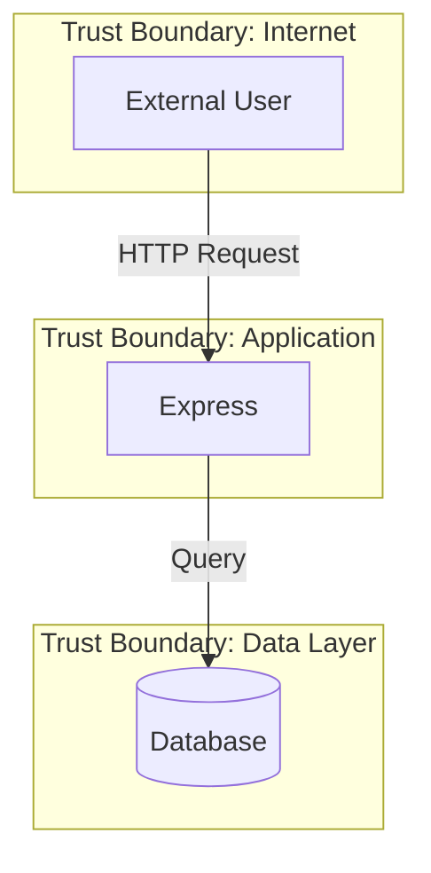

# Threat Modeling

> **Maturity Level: 3 (Defined)** - Production-ready automated threat analysis with accurate asset inventory and data flow mapping

Automated threat analysis using STRIDE framework, architecture mapping, and attack surface assessment.

## Threat Modeling Maturity Levels

- **Level 1** (Initial): Basic pattern matching only
- **Level 2** (Repeatable): Framework detection and component discovery
- **Level 3** (Defined): Accurate data flows, asset inventory, and trust boundaries ✅ **← Current**
- **Level 4** (Managed): Runtime threat detection and continuous monitoring (roadmap)
- **Level 5** (Optimizing): Automated threat intelligence integration (roadmap)

## What It Does

Generates comprehensive threat models by:

1. **Architecture Discovery** - Identifies components, frameworks, entry points, and data stores (language-agnostic)
2. **STRIDE Analysis** - Maps security findings to threat categories
3. **Attack Surface Mapping** - Quantifies external-facing risks with accurate route counting
4. **Trust Boundary Identification** - Highlights security control points between layers
5. **Threat Scenario Generation** - Creates actionable threat descriptions with business impact
6. **Visual Diagrams** - Generates Mermaid architecture diagrams with real data flow connections
7. **Database Deduplication** - Consolidates duplicate database references into single assets

## Output

Threat models are saved to: `outputs/{repo}/{branch}/`

- **threat_model.json** - Structured threat data
- **THREAT_MODEL.md** - Human-readable report
- **architecture.mermaid** - Visual architecture diagram

## Usage

### CLI

```bash
./start_cli.sh
# Select "Generate Threat Model" from menu
```

### Web Interface

```bash
./start_web.sh
# POST to /threat-model endpoint with repo_path
```

### MCP (Claude Desktop)

```
"Generate a threat model for nodejs-goof"
```

### Python API

```python
from threat_modeling import ThreatAnalyzer

# Create analyzer
analyzer = ThreatAnalyzer('/path/to/repo')

# Generate threat model
threat_model = analyzer.analyze(security_findings)

# Export to files
analyzer.export_threat_model(threat_model, 'outputs/my-repo/main')
```

## STRIDE Framework

Threats are categorized using Microsoft's STRIDE model:

- **Spoofing** - Authentication bypass, credential theft
- **Tampering** - SQL injection, XSS, CSRF, path traversal
- **Repudiation** - Missing audit logs, insufficient tracking
- **Information Disclosure** - Exposed secrets, data leakage
- **Denial of Service** - Resource exhaustion, regex DoS
- **Elevation of Privilege** - Command injection, RCE, XXE

## Architecture Components

### Auto-Detected Elements (Language-Agnostic)

**Frameworks** (6 languages supported):
- **Node.js/TypeScript**: Express
- **Python**: Flask, Django, FastAPI
- **Java**: Spring Boot (all annotations: @RequestMapping, @GetMapping, etc.)
- **PHP**: Laravel
- **Ruby**: Rails (partial support)
- **Go**: Generic HTTP handlers (partial support)

**Entry Points:**
- HTTP endpoints with route extraction (GET /login, POST /api/users, etc.)
- Security-critical routes highlighted (/login, /admin, /auth, /password, /api)
- Route aggregation (shows "10 routes (GET /login, POST /login...)" instead of just first route)
- User input handlers (forms, query params, request bodies)

**Data Stores** (8 database types):
- **Relational**: PostgreSQL, MySQL, SQLite, MSSQL, Oracle
- **NoSQL**: MongoDB, Redis, Cassandra
- **Deduplication**: Multiple files referencing same database are consolidated into single asset
- **Data Flow Tracking**: Tracks which files access which databases for accurate threat modeling

**External Dependencies:**
- npm, pip, Maven, Bundler packages (direct dependencies)

### Trust Boundaries

Automatically identified security control points:

1. **External → Application** - User requests crossing into system
2. **Application → Database** - Data layer access
3. **Application → Third-party Services** - External API calls

Each boundary includes:
- Risk level (HIGH/MEDIUM/LOW)
- Required security controls
- Recommended mitigations

## Attack Surface Scoring

Calculates exposure based on:

- HTTP endpoint count (weight: 2x)
- Data store count (weight: 10x)
- External dependency count (weight: 1x)

**Score Ranges:**
- **HIGH** (70+) - Large attack surface, extensive entry points
- **MEDIUM** (40-69) - Moderate exposure
- **LOW** (<40) - Minimal external facing components

## Threat Scenarios

Generates concrete attack scenarios including:

- **Attack Vector** - How the attack is executed
- **Impact** - Consequences of successful exploitation
- **Severity** - CRITICAL/HIGH/MEDIUM/LOW
- **Mitigation** - Remediation recommendations

Scenarios are prioritized by severity (Critical → High → Medium → Low).

## Integration with Security Scans

Threat modeling enhances security scan results by:

1. **Mapping findings to STRIDE** - Categorizes vulnerabilities by threat type
2. **Architecture context** - Shows where vulnerabilities exist in system design
3. **Attack chain visualization** - Connects entry points to vulnerable components
4. **Business impact** - Relates threats to real-world attack scenarios

Best practice: Run security scan first, then generate threat model.

## Example Output

### Summary
```
Total Threats Identified: 47
Attack Surface Risk: HIGH
Overall Risk Level: HIGH

STRIDE Breakdown:
- Spoofing: 3
- Tampering: 18
- Repudiation: 1
- Information Disclosure: 22
- Denial of Service: 0
- Elevation of Privilege: 3
```

### Architecture Diagram


### Threat Scenario Example
```
Title: SQL Injection in User Login
Severity: CRITICAL

Attack Vector: Attacker supplies malicious input that gets executed as code

Impact: Complete system compromise, data breach, or service disruption

Mitigation: Use parameterized queries and input validation
```

## When to Generate Threat Models

**Ideal Use Cases:**

- ✅ New application/feature development
- ✅ Security architecture reviews
- ✅ Pre-deployment risk assessments
- ✅ Compliance requirements (SOC2, ISO 27001)
- ✅ Post-incident analysis
- ✅ Third-party code reviews

**Frequency:**

- **Initial:** At project inception
- **Regular:** After major feature additions
- **Triggered:** When high-severity findings detected
- **Compliance:** Quarterly or per audit schedule

**NOT Recommended For:**

- ❌ **CI/CD Pipelines** - Threat models don't change every commit; use on-demand instead
- ❌ **Every Pull Request** - Adds noise without value; better for strategic reviews
- ❌ **Hot-path Critical Builds** - Use for architecture changes, not routine code changes

**Best Practice:** Run vulnerability scans in CI/CD (automated). Run threat modeling on-demand via CLI/Web/MCP (strategic).

## Architecture

### Processing Flow

```
Repository
    ↓
Framework Detection
    ↓
Component Discovery
    ↓
Entry Point Mapping
    ↓
Trust Boundary Identification
    ↓
STRIDE Analysis (with scan findings)
    ↓
Threat Scenario Generation
    ↓
Export (JSON + Markdown + Mermaid)
```

### Integration Points

- **src/main.py** - CLI threat model command
- **src/web_app.py** - `/threat-model` endpoint
- **mcp/appsec_mcp_server.py** - `generate_threat_model` tool

### File Structure

```
src/threat_modeling/
  ├── __init__.py
  └── threat_analyzer.py       # Core threat modeling engine

outputs/{repo}/{branch}/
  ├── threat_model.json         # Structured data
  ├── THREAT_MODEL.md           # Human-readable report
  └── architecture.mermaid      # Visual diagram
```

## Configuration

No configuration required - works out-of-the-box.

**Optional:** Combine with security scans for enhanced analysis:

```bash
# CLI: Run full scan + threat model
./start_cli.sh
# 1. Select "Run Security Scan"
# 2. Select "Generate Threat Model"

# Web: Sequential requests
curl -X POST http://localhost:8000/scan -d '{"repo_path": "/path/to/repo"}'
curl -X POST http://localhost:8000/threat-model -d '{"repo_path": "/path/to/repo"}'
```

## Limitations & Roadmap

### Current Limitations

**Level 3 (Current)**:
- ✅ **Database Deduplication**: Fixed - accurately consolidates duplicate database references
- ✅ **Data Flow Accuracy**: Fixed - traces actual file→database relationships from code
- ✅ **Route Visualization**: Fixed - shows aggregated routes with security-critical endpoints highlighted
- ✅ **Language-Agnostic**: Works across Node.js, Python, Java, PHP, Ruby, Go

**Known Limitations**:
- ⚠️ **Static Analysis Only** - Does not discover runtime behavior or dynamic routes
- ⚠️ **Custom Frameworks** - May miss proprietary or heavily customized frameworks
- ⚠️ **Dependency Depth** - Counts direct dependencies only (not transitive)
- ⚠️ **Microservices Mesh** - Run per-service (no cross-service visualization yet)
- ⚠️ **Partial Go/Ruby Support** - Generic patterns only (not framework-specific like Express/Flask)

### Under Construction 🚧

**Level 4 (Roadmap)**:
- Runtime threat detection (dynamic analysis)
- Continuous threat monitoring
- Threat intelligence feed integration
- Microservices mesh visualization
- Custom threat frameworks (PASTA, VAST, OCTAVE)

**Level 5 (Future)**:
- Machine learning threat prioritization
- Automated threat response
- Historical trend analysis
- Threat hunting automation

## Best Practices

1. **Run After Security Scans** - Threat model benefits from vulnerability context
2. **Review Manually** - Automated analysis is a starting point, not complete
3. **Update Regularly** - Regenerate after architectural changes
4. **Document Mitigations** - Track which threats have been addressed
5. **Share with Team** - Use THREAT_MODEL.md for security discussions

## FAQ

**Q: How is this different from vulnerability scanning?**

A: Vulnerability scanning finds specific bugs. Threat modeling identifies architectural risks and attack patterns before they become vulnerabilities.

**Q: Do I need security expertise?**

A: No. Threat models are generated automatically with plain-English explanations. Security review is recommended but not required.

**Q: Does this replace manual threat modeling?**

A: No. It accelerates threat modeling by automating discovery and categorization. Manual review adds business context and custom threats.

**Q: Can I customize STRIDE categories?**

A: Currently uses standard STRIDE. Custom threat frameworks can be added by extending `ThreatAnalyzer`.

**Q: How accurate is framework detection?**

A: Very accurate for major frameworks (Express, Flask, Spring, etc.). May miss custom or proprietary frameworks.

**Q: What about microservices?**

A: Run threat modeling per service. Each microservice gets its own threat model showing its attack surface and internal threats.

## Contributing

Contributions welcome! Areas for enhancement:

- Additional framework detection patterns
- Custom threat framework support (PASTA, VAST, etc.)
- Enhanced diagram generation
- Integration with threat intelligence feeds
- Machine learning for threat prioritization

## Performance

Threat modeling is optimized for speed while maintaining excellent coverage:

- **Small repos (< 100 files)**: < 1 second
- **Medium repos (100-1K files)**: < 1 second
- **Large repos (1K-10K files)**: 1-2 seconds
- **Real-world example**: 661-file Java repo completes in 0.07 seconds

**Key Optimizations:**
- Reads only first 100KB per file for pattern matching
- Skips files > 1MB (build artifacts, minified code)
- Uses intelligent caching to avoid duplicate I/O
- Scans up to 1000 files by default (configurable via `THREAT_MODEL_MAX_FILES`)

See `CLAUDE.md` for detailed performance benchmarks and optimization details.

---

## Recent Improvements (v1.2.0)

**Database Deduplication** (2025-01-05):
- Fixed duplicate database nodes in architecture diagrams
- Consolidated multiple file references to same database into single asset
- Added `accessing_files` tracking for accurate data flow analysis
- Example: nodejs-goof now shows 2 databases (MongoDB + MySQL) instead of 5 duplicates

**Route Visualization Enhancement** (2025-01-05):
- Fixed route aggregation (was showing only "GET /", now shows all routes)
- Highlights security-critical routes (/login, /admin, /auth, /password, /api)
- Shows route counts with key endpoints: "10 routes (GET /login, POST /login...)"
- Improves attack surface visibility for threat modeling

**Data Flow Accuracy** (2025-01-05):
- Fixed component→database connections (was arbitrary, now traces actual relationships)
- Maps which files access which databases based on code analysis
- Eliminates orphaned databases in diagrams
- Critical for accurate trust boundary analysis

---

**Version:** 1.2.0
**Last Updated:** 2025-01-05
**Maturity Level:** 3 (Defined)
**Status:** Production Ready - Language-Agnostic Threat Modeling
